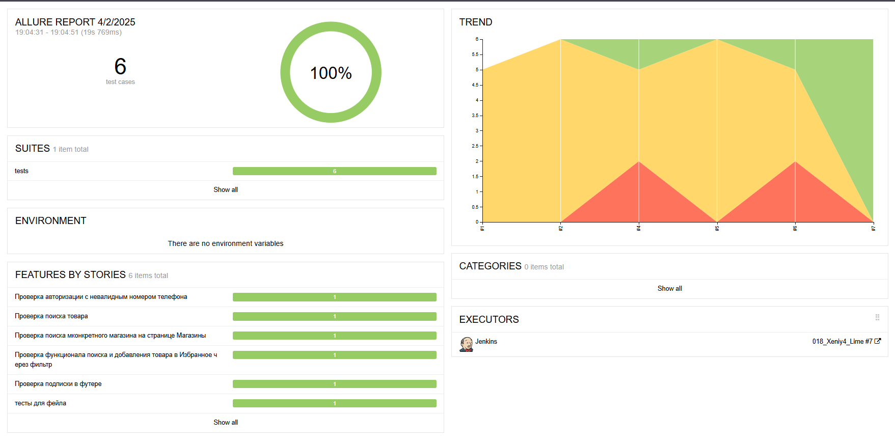
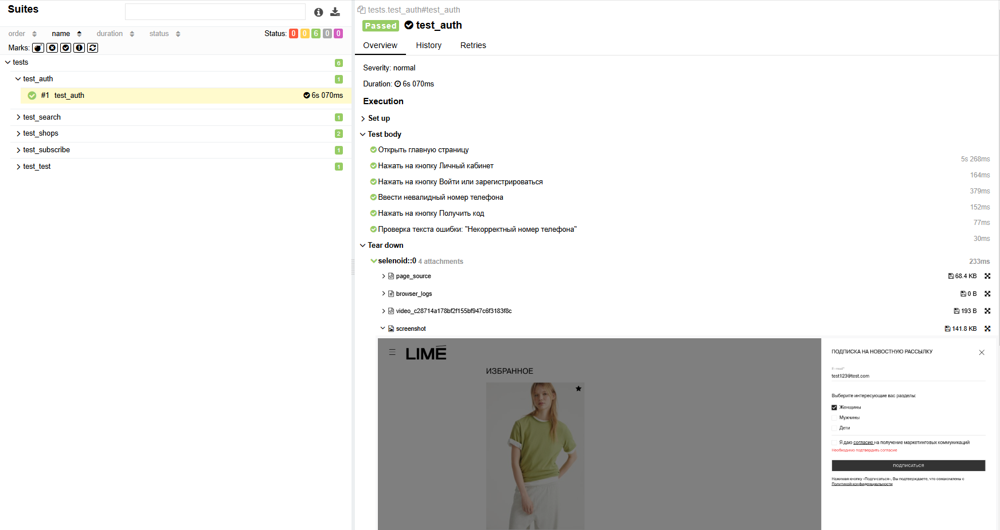
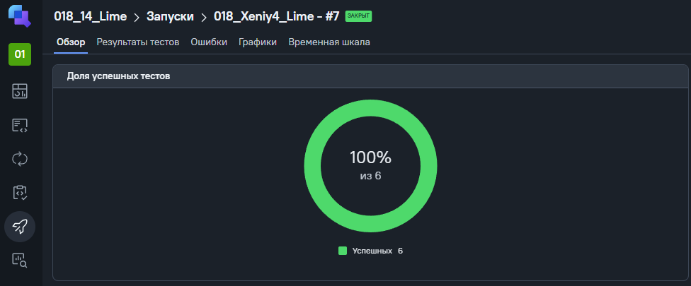
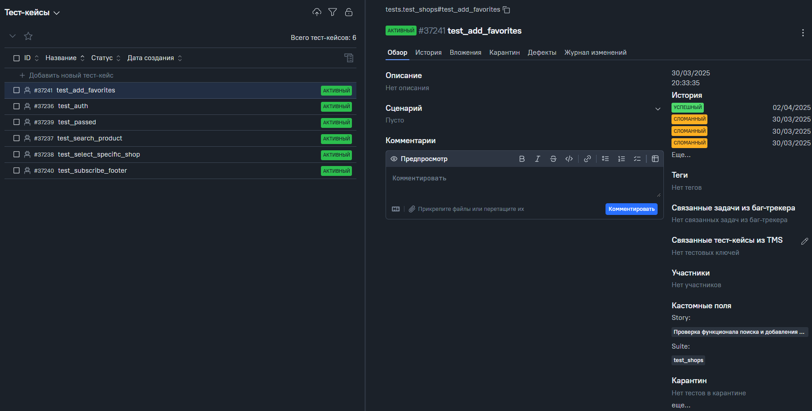
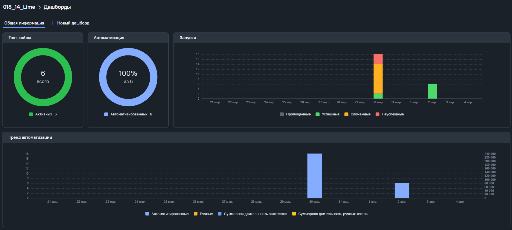
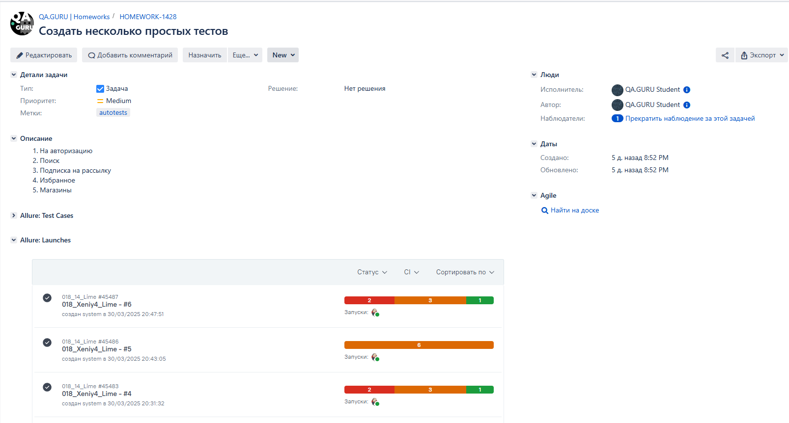
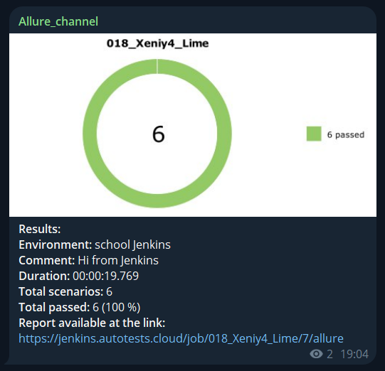

## Простые тесты для интернет-магазина Lime

[Lime](https://lime-shop.com/ru_ru)

---
> Оперативно интерпретируя подиумные тренды, LIMÉ поощряет креативный подход 
> к составлению гардероба. Каждый потребитель выбирает среди многообразия ассортимента то, 
> что лучше всего отражает его индивидуальность.
 


Список проведенных проверок:
- Авторизация
- Поиск магазина
- Карточки товара
- Подписка на рассылку
- Работа поиска

---

Проект реализован с использованием актуальных инструментов:  
            


- Язык программирования `Python`
- Фреймворк для написания UI тестов `Selene` с использованием `Selenium WebDriver`
- Фреймворк модульного тестирования `Pytest`
- Выполнение удаленного запуска тестов с помощью `Jenkins` с использованием `Selenoid`
- Фреймворки для сбора отчетности и хранения файлов тестирования `Allure Report`
- Инструмент для сбора и хранения статистики тестов `Allure TestOps`
- Интеграция с системой управления проектами `Jira` + `Allure TestOps`
- Краткие отчеты в `Telegram` отправляет `Telegram Bor`

---

### Локальный запуск
Перед запуском в корне проекта создать файл .env с содержимым:
```
SELENOID_LOGIN=user1
SELENOID_PASS=1234
SELENOID_URL=selenoid.autotests.cloud
```

Для локального запуска необходимо выполнить:
```
python -m venv .venv
source .venv/bin/activate
pip install -r requirements.txt
pytest .
```

---
### Удаленный запуск тестов выполняется в Jenkins
Посмотреть и запустить можно на странице проекта в [Jenkins](https://jenkins.autotests.cloud/job/018_Xeniy4_Lime/).

Для запуска тестов необходимо:
1. Перейти на [проект](https://jenkins.autotests.cloud/job/018_Xeniy4_Lime/)
2. Нажать на кнопку `Build now`
3. Дождаться окончания тестирования
4. Нажать на кнопку `Allure Report` 

Откроется страница отчета



Детальная информация с шагами и аттачментами отображается в разделе `Suites`



### Статистика отчета хранится в Allure TestOps
Последний отчет можно посмотреть по [ссылке](https://allure.autotests.cloud/project/4689/test-cases/37241?treeId=0)  
Для просмотра статистики после запуска в Jenkins в шаге 4 необходимо нажать на кнопку `Allure TestOps` 



Детальная информация по тест-кейсам



Дашборд со статистикой и графиками запусков




### Интеграция с Jira
[Задача-1428](https://jira.autotests.cloud/browse/HOMEWORK-1428)




### Отчет о результатах тестирования в Telegram
Отчеты приходят в канал [Allure_channel](https://t.me/Allure_channel_autotests)




